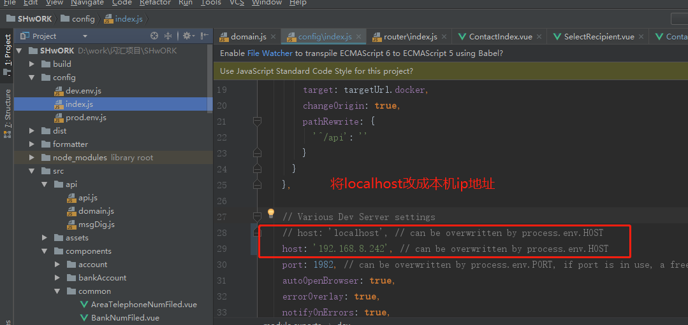
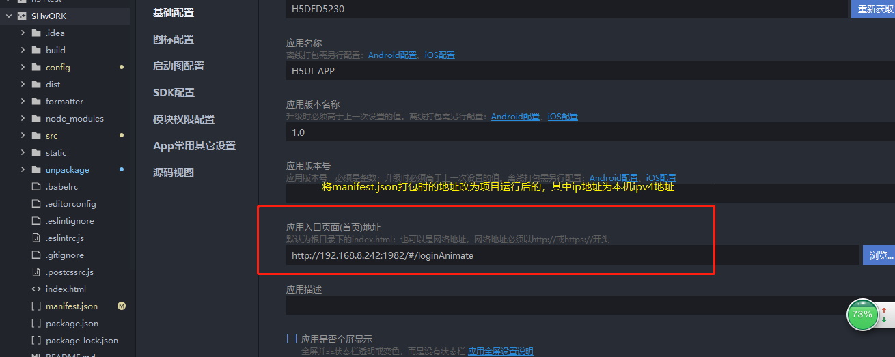
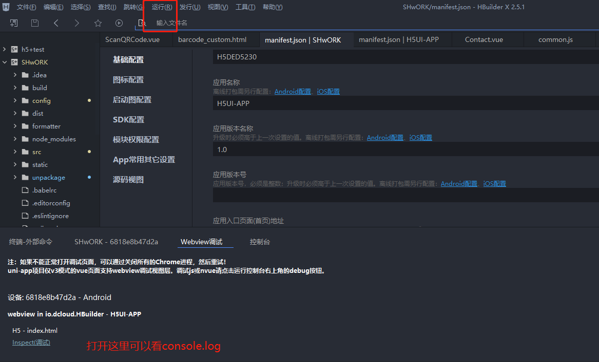

# vue-HBuilderX-h5-
在项目中使用HBuilderX将vue，h5+打包成为app，从而使用部分原生功能
## 调试
首先HBuilder可以支持真机调试是在谷歌浏览器打印值
1.将config/index.js里面的localhost改成本机ip地址

2.将manifest.json里的打包成app的入口地址改成npm run dev后的浏览器地址

3.使用手机连接电脑-运行-运行到手机或者模拟器-选择自己的手机设备（显示webview调试控制台）

4.特别说明：这时在项目运行的时候直接打包成app，安装到手机上可以实时更新页面（应该是加了一层盒子，里面访问的还是h5页面），这样就可以不用真机运行了。不过这样看不了控制台。
